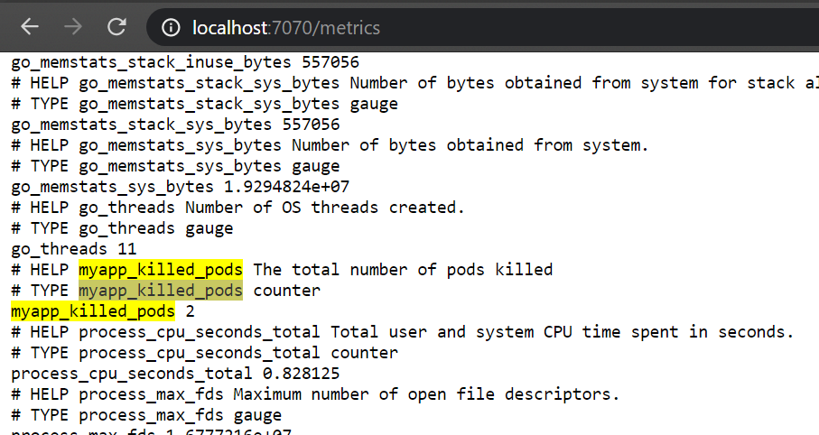
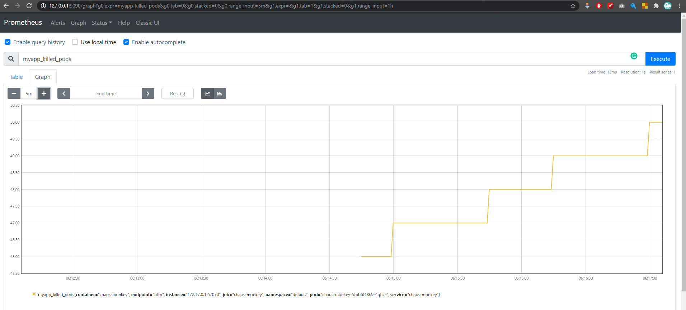
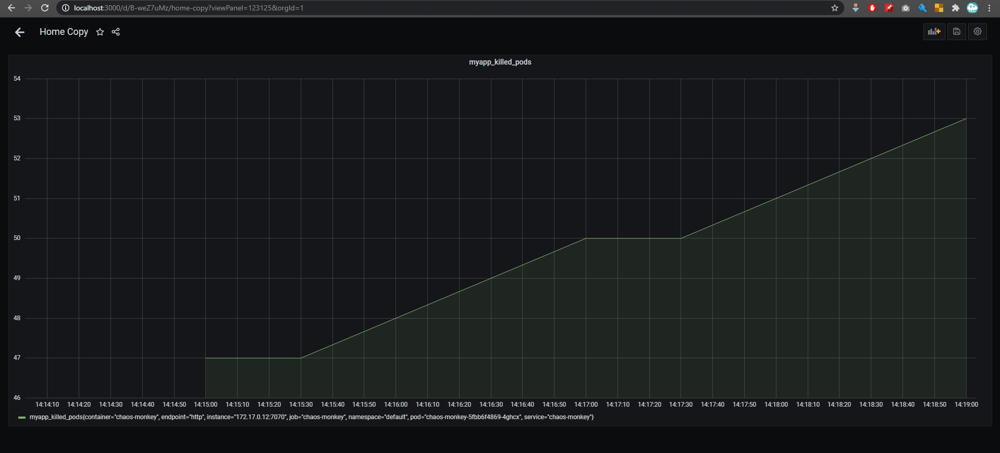

# Chaos_Monkey
Chaos_Monkey


## Deployment

To deploy to kubernetes 


Checkout the repository and run 

to Authrize the service access the default namespace 
```
make auth
```

to install the helm chart  

```
helm install chaos-monkey ./chaos-monkey/ --set service.type=NodePort
```
or 

```
make install
```

to access the pod service you can run 

```
  export NODE_PORT=$(kubectl get --namespace default -o jsonpath="{.spec.ports[0].nodePort}" services chaos-monkey)
  export NODE_IP=$(kubectl get nodes --namespace default -o jsonpath="{.items[0].status.addresses[0].address}")
  echo http://$NODE_IP:$NODE_PORT
```

to deploy 4 replicas of nginx 

``` 
make deploytest
```


### Testing 
to deploy 4 replicas of nginx 

``` 
make deploytest
```

## Config 

to change interval while it is running 

```
/config?interval=60
```

to change namespce while it is running 

```
/config?namespce=default
```

## Screens 

Pod logs 


Killing log


config interval while it is running 


webview of pod 


prometheus metric



## Extra for RBAC

to Authrize the pod access the default namespace 
 
```
make auth 
```
it will add the role admin to the service 

```
apiVersion: rbac.authorization.k8s.io/v1beta1
kind: ClusterRoleBinding
metadata:
  name: admin-rbac
subjects:
  - kind: ServiceAccount
    # Reference to upper's `metadata.name`
    name: default
    # Reference to upper's `metadata.namespace`
    namespace: default
roleRef:
  kind: ClusterRole
  name: cluster-admin
  apiGroup: rbac.authorization.k8s.io
```


## Build 

```
make build
```

## Monitoring with prometheus 

to install prometheus in Kubernetese you can run  

```
make monitoring
```

prometheus metric


prometheus graph


grafana graph



